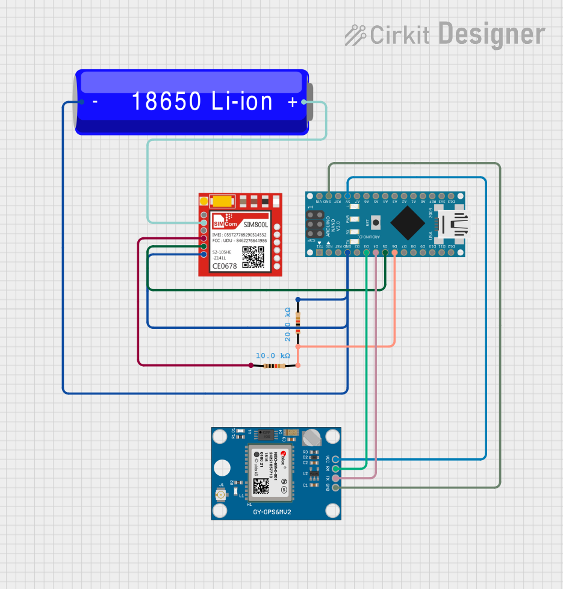

# OnTime G1 IoT Project

Welcome to the **OnTime G1** repository! This repository contains the firmwares and testing scripts for our IoT system utilizing an **Arduino Nano**, **NEO-6M GPS**, **SIM800L GSM module**, and **HiveMQ MQTT Broker**.

To make it easier for our team and standard users to replicate and push the code, this guide provides a step-by-step process with diagrams.

---

## 🛠️ Hardware Requirements
- **Microcontroller**: Arduino Nano
- **GPS Module**: NEO-6M (or similar GPS Neo module)
- **GSM Module**: SIM800L (Needs stable 3.7V - 4.2V 2A power supply)
- **MQTT Broker**: HiveMQ (Cloud or Local)
- **Miscellaneous**: Jumper wires, Breadboard, Logic Level Converters (if strictly required for RX/TX 5V/3.3V).

---

## 🚀 Step 1: GPS Setup & Test

The first step is to verify that the NEO-6M GPS module is receiving coordinates. Place the module near a window or outdoors to get a satellite fix (the LED on the GPS will start blinking).

### Wiring Diagram (GPS -> Arduino Nano)

### Instructions:
1. Connect the hardware as shown in the diagram above.
2. Open the `Component Check/GPS_Check` sketch and load it onto your Arduino.
3. Open the Serial Monitor at **9600 baud**.
4. **Expected Output**: You should see latitude and longitude printed on the screen once a satellite fix is achieved.

*(If your GPS module requires a firmware reset/update to change baud rates or frequencies, refer to `Firmware Updates/GPS_Firmware_Update`).*

---

## 🚀 Step 2: GSM Network Check

Before sending data to the cloud, verify that the SIM800L module registers to the cellular network. The SIM800L requires a strong power supply (up to 2A peaks). **Do not power it directly from the Arduino Nano's 5V pin** or it will reboot under load.

### Wiring Diagram (GSM -> Arduino Nano)

### Instructions:
1. Ensure your SIM card has an active data plan and no PIN lock. 
2. Wire the SIM800L according to the diagram above. Ensure the grounds are shared!
3. Open the `Component Check/GSM_Check` sketch and flash the code.
4. Open the Serial Monitor.
5. **Expected Output**: Sending `AT` should return `OK`. Checking `AT+CPIN?` should say `READY`, and `AT+CREG?` should show `0,1` or `0,5` (registered to network).

---

## 🚀 Step 3: GSM + MQTT Connection (Dummy Data)

Once the network connection is verified, we can test the MQTT link to **HiveMQ**.

### Instructions:
1. Make sure your HiveMQ cluster is configured. Note your **Broker URL**, **Port** (usually `1883` or `8883`), **Username**, and **Password**.
2. Open the `Testing_Dummy_Data/GSM+MQTT+Dummy` sketch.
3. Edit the code to include your APN (e.g., `internet`), HiveMQ broker credentials, and topic.
4. Flash the code to the Arduino.
5. Use an MQTT client (like MQTTX or HiveMQ Web Client) to subscribe to your topic.
6. **Expected Output**: You should see dummy JSON or text data arriving at your HiveMQ topic every few seconds.

---

## 🚀 Step 4: The Core System (GSM + GPS + MQTT)

Now we connect everything together. The Arduino will read coordinates from the GPS and publish them to HiveMQ via the SIM800L.

### Complete System Wiring

Kalman Filter
Why It Is Needed
A GPS module does not give a perfectly still reading even when the device is not moving. Satellite signals bounce off buildings and shift slightly every second. Without filtering, the bus position on the map jumps around by 5–15 metres even when stationary.

A Kalman filter solves this by blending two sources of information:

What we predict — based on where the bus was last time
What the GPS says — the new raw measurement
It weights them intelligently: if the GPS is very noisy, trust the prediction more. If the GPS is reliable, trust the new reading more.

How It Works — Step by Step
Every time a new GPS coordinate arrives, the filter runs 4 steps:

Step 1 — Prediction
  p = p + q
  (Confidence in our estimate gets slightly worse over time
   because the bus has moved since the last reading)

Step 2 — Kalman Gain
  k = p / (p + r)
  (How much should we trust the new GPS reading?
   High noise r → small k → trust old estimate more
   Low noise r  → large k → trust new reading more)

Step 3 — Correction
  x = x + k × (new_gps_reading − x)
  (Blend old estimate with new reading, weighted by k)

Step 4 — Update Error
  p = (1 − k) × p
  (Confidence improves now that we have a new measurement)
The Two Tuning Variables
KalmanFilter kfLat = {0.0001, 0.01, 0.0, 1.0, 0.0, false};
//                     q       r
Variable	Name	Effect
q	Process noise	Lower = smoother path, slower to follow sharp turns
r	Measurement noise	Higher = trust GPS less, smoother but more lag
Recommended values by environment:

Environment	q	r	Result
Open road, clear sky	0.00001	0.005	Very smooth
Urban streets, normal	0.0001	0.01	Balanced (default)
Dense city, noisy GPS	0.001	0.05	More responsive
Where the Filter Is Added in the Code
1. After your #include block — add the struct and function:

// ==========================================
// KALMAN FILTER
// ==========================================
struct KalmanFilter {
  double q;           // process noise
  double r;           // measurement noise
  double x;           // current filtered value
  double p;           // estimation error
  double k;           // kalman gain
  bool   initialised;
};

KalmanFilter kfLat = {0.0001, 0.01, 0.0, 1.0, 0.0, false};
KalmanFilter kfLon = {0.0001, 0.01, 0.0, 1.0, 0.0, false};

double kalmanUpdate(KalmanFilter &kf, double measurement) {
  if (!kf.initialised) {
    kf.x = measurement;
    kf.initialised = true;
    return kf.x;
  }
  kf.p = kf.p + kf.q;
  kf.k = kf.p / (kf.p + kf.r);
  kf.x = kf.x + kf.k * (measurement - kf.x);
  kf.p = (1 - kf.k) * kf.p;
  return kf.x;
}
2. Inside readGPS() — change 2 lines where raw lat/lon are stored:

// BEFORE:
lat = newLat;
lon = newLon;

// AFTER:
lat = kalmanUpdate(kfLat, newLat);
lon = kalmanUpdate(kfLon, newLon);
3. Inside readGPS() — reset filter if GPS signal is lost:

if (!gps.location.isValid()) {
  kfLat.initialised = false;
  kfLon.initialised = false;
}
The reset prevents the filter from slowly drifting back to an old position after a tunnel or signal gap.

Why Two Separate Filters?
Latitude and longitude are completely independent axes. A bus moving east changes longitude only. A separate filter for each axis means neither one influences the other — they are treated as separate 1D problems, which is the correct way to apply a Kalman filter to 2D GPS coordinates.

*Note: If possible, use Hardware Serial for one of the modules (like the GSM) if running out of SoftSerial resources, or use `SoftwareSerial::listen()` intelligently, as the Arduino Nano (ATmega328P) cannot listen to two SoftwareSerial ports simultaneously.*

### Instructions:
1. Assemble all connections on the breadboard or PCB prototype.
2. Open `Full_Implementation/GSM+GPS+MQTT` and update the sketch with your specific APN and HiveMQ Broker details.
3. Upload the sketch.
4. **Expected Output**: The Arduino will print `"GPS Fix acquired..."` and successfully publish genuine coordinates to the HiveMQ topic. 

### Contributing
Before pushing your IoT team codes to the G1 repo on top of these templates:
1. Ensure they remain cleanly separated into their respective structural folders (e.g., `Component Check`, `Full_Implementation`).
2. Add any updated sketches directly in those folders.
3. Don't commit sensitive credentials (like your actual HiveMQ production password). Use placeholder variables or header files omitted by `.gitignore`.

   
